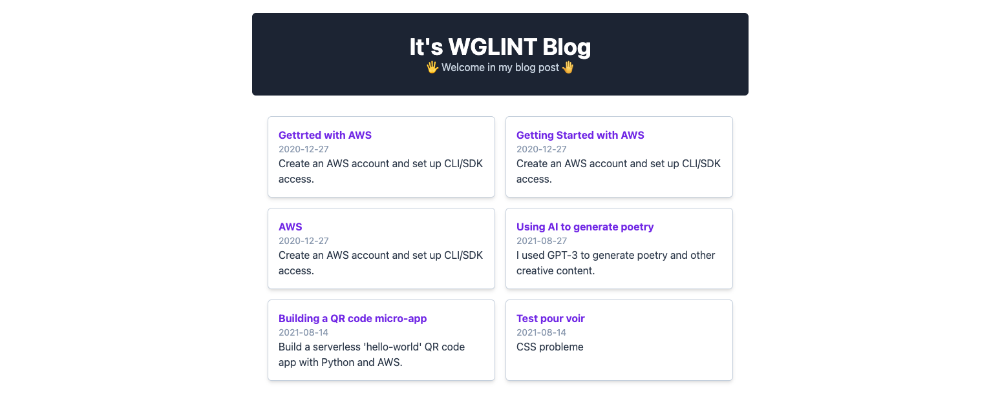

## Static Blog - NextJS13

It's a blog static with **100% performance** for a better SEO and user experience.  
For blog, it's use Markdown file with JSX-to-Markdown librairy



# How run this website in local

First, run the development server:

```bash
npm i
npm run dev
# or
yarn add
yarn dev
# or
pnpm i
pnpm dev
```

Open [http://localhost:3000](http://localhost:3000) with your browser to see the result.

## Learn More

To learn more about Next.js, take a look at the following resources:

- [Next.js Documentation](https://nextjs.org/docs) - learn about Next.js features and API.
- [Learn Next.js](https://nextjs.org/learn) - an interactive Next.js tutorial.

You can check out [the Next.js GitHub repository](https://github.com/vercel/next.js/) - your feedback and contributions are welcome!
